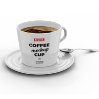

---

# ☕ Caffeine Cove – Restaurant Website


A modern, responsive, and visually engaging restaurant website for **Caffeine Cove**, a cozy cafe offering quality coffee and a welcoming atmosphere. Built using **HTML5**, **CSS3**, and **Font Awesome**, this site provides an interactive experience for visitors to explore your menu, learn about your cafe, and make reservations.

---

## 🌟 Features

* **Responsive Design:** Works seamlessly on desktops, tablets, and mobile devices
* **Interactive Menu:** Showcases popular drinks with images, details, and pricing
* **About Section:** Highlights cafe story, sustainability, and ambiance
* **Testimonials:** Attractive section for client feedback
* **Contact & Reservation:** Fully styled form with Google Maps integration
* **Social Media Links:** Connect with Facebook, Twitter, YouTube, Instagram, Pinterest
* **Fixed Navigation:** Smooth scrolling with easy access to all sections

---

## 🛠️ Technologies Used

| Technology        | Purpose                                      |
| ----------------- | -------------------------------------------- |
| HTML5             | Structure & semantic markup                  |
| CSS3              | Styling & responsive layouts                 |
| Google Fonts      | "Open Sans" & "Oswald" for typography        |
| Font Awesome      | Icons for navigation, menu, and social media |
| Google Maps Embed | Display cafe location                        |

---

## 📂 Project Structure

```
Caffeine-Cove/
│
├─ index.html                  # Main HTML file
├─ newcaffe.css                # Main CSS stylesheet
├─ CafeResturentImages/        # All images used in the website
│   ├─ logo.png
│   ├─ coffee-home.png
│   ├─ about-img.png
│   ├─ menu-1.png
│   ├─ menu-2.png
│   └─ ... (menu, testimonial, and other images)
├─ favicon.ico                 # Website icon
└─ README.md                   # Project README
```

---

## 🚀 Getting Started

1. Clone the repository:

```bash
git clone https://github.com/s0fri/Caffeine-Cove.git
```

2. Navigate into the project folder:

```bash
cd Caffeine-Cove
```

3. Open `index.html` in your browser

> ⚠️ Make sure the `CafeResturentImages` folder stays in the same directory as `index.html` to display all images correctly.

---

## 🎨 Screenshots

### Home Section


### About Section


### Menu Section



### Testimonials Section


### Contact & Reservation


---

## 📌 Notes

* **Static Website:** No backend functionality yet; the contact form does not submit data
* **Customizable:** Easily change colors, fonts, or menu items in `newcaffe.css`
* **Optimized for Performance:** Lightweight images and responsive layouts for fast loading

---

## 🌐 Live Demo

You can host this website for free using **GitHub Pages**:

1. Push the repository to GitHub
2. Go to repository **Settings → Pages**
3. Set the source to `main` branch → `/root`
4. Access your live demo at: `https://your-username.github.io/Caffeine-Cove/`

---

## 👨‍💻 Author

**ooooobay** – Aspiring Full-Stack Developer
📧 Email: [mohammed01bm@gmail.com](mailto:mohammed01bm@gmail.com)
🌍 Location: Laghouat, Algeria

---

## 🏷️ License

This project is **open source** and free to use, modify, and distribute.

---

## 🔗 Social Media

Connect with Caffeine Cove:
[](#)
[](#)
[](#)
[](#)

---